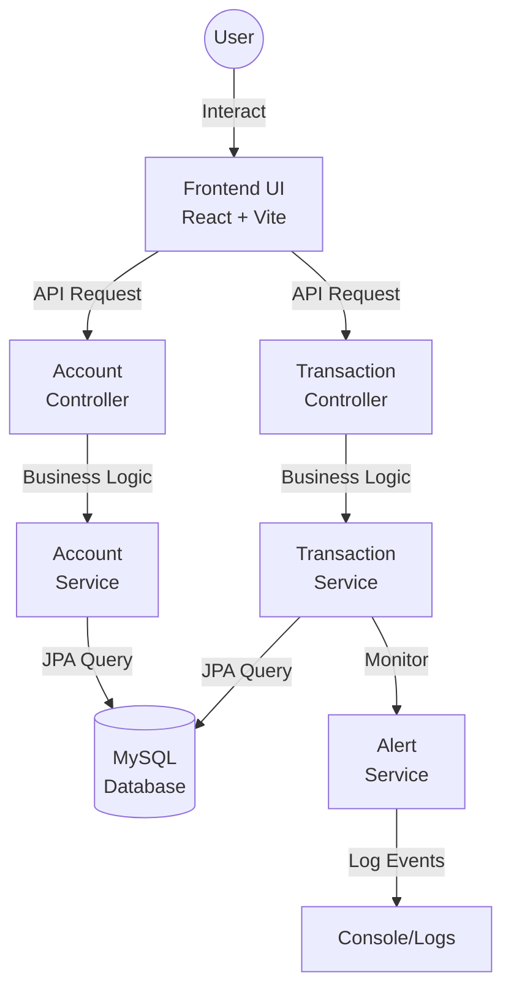

# VaultX Exchange

A modern, premium banking simulation platform designed for secure and efficient financial management. Built with a robust Spring Boot backend and a dynamic React frontend featuring a high-end dark-themed aesthetic with glassmorphism effects.

---

## Overview

VaultX Exchange is a full-stack financial management application that demonstrates professional banking operations including account management, fund transfers, and real-time transaction monitoring. The platform prioritizes user experience with an intuitive interface and responsive design.

**Branding:**
- **Vault** - Navy Blue  
- **X** - Red  
- **Exchange** - Gray (Uppercase)

---

## Features

### Currently Implemented
- **Account Management**: Create and manage multiple accounts with automated account number generation
- **Financial Operations**: Deposits, Withdrawals, and Internal Transfers between accounts
- **Dynamic Dashboard**: Real-time balance overview and recent activity tracking
- **Account Details View**: In-depth transaction history and account status
- **Premium UI/UX**: Dark-mode interface with glassmorphism effects, smooth animations, and responsive layouts
- **Transaction Monitoring**: System-level alerts for high-value transactions with console logging

### Planned Features
- **User Authentication**: Secure Login/Signup with JWT or OAuth2 integration
- **Email Notifications**: SMTP integration for real-time transaction alerts
- **Analytics Dashboard**: Interactive charts and spending pattern analysis
- **Profile Management**: User avatars, personal details, and security settings
- **Multi-currency Support**: Hold and transfer funds in multiple global currencies
- **Advanced Search & Filters**: Historical transaction lookup and filtering capabilities

---

## System Architecture

### Architecture Diagram
```
┌─────────────────────────────────────────────────────────────────┐
│                          USER INTERFACE                          │
│                    (React + Vite Frontend)                       │
│  ┌────────────────────────────────────────────────────────────┐ │
│  │  Landing Page │ Dashboard │ Account Detail │ Forms         │ │
│  └────────────────────────────────────────────────────────────┘ │
└────────────────────────────┬────────────────────────────────────┘
                             │ HTTP/REST API
┌────────────────────────────▼────────────────────────────────────┐
│                    BACKEND SERVICES                              │
│              (Spring Boot 3.2.x on Java 17)                     │
│  ┌────────────────────────────────────────────────────────────┐ │
│  │ Controllers │ Services │ Repositories │ Database Layer     │ │
│  └────────────────────────────────────────────────────────────┘ │
└────────────────────────────┬────────────────────────────────────┘
                             │ JPA/Hibernate
┌────────────────────────────▼────────────────────────────────────┐
│                     PERSISTENCE LAYER                            │
│                    MySQL Database                                │
│  (Accounts, Transactions, User Data)                            │
└─────────────────────────────────────────────────────────────────┘
```

### Data Flow



---

## Project Structure

### Frontend Architecture (`/frontend/src`)

```
frontend/
├── pages/
│   ├── LandingPage.jsx          # Premium landing experience
│   ├── Dashboard.jsx             # Main account hub
│   └── AccountDetail.jsx         # Individual account view
├── components/
│   ├── AccountForm.jsx           # Account creation/editing
│   ├── TransactionForm.jsx       # Financial operations (unified)
│   ├── Alert.jsx                 # Global notifications
│   ├── AccountList.jsx           # Account listing component
│   └── TransactionList.jsx       # Transaction history display
├── services/
│   └── api.js                    # Backend API integration
├── styles/
│   └── index.css                 # Glassmorphism & animations
└── App.jsx                       # Main app component
```

### Backend Architecture (`/src/main/java/com/bank`)

```
backend/
├── controller/
│   ├── AccountController.java    # Account CRUD endpoints
│   └── TransactionController.java # Financial operations endpoints
├── service/
│   ├── AccountService.java       # Account lifecycle logic
│   ├── TransactionService.java   # Transaction processing
│   └── AlertService.java         # Monitoring & alerting
├── entity/
│   ├── Account.java              # Account entity model
│   └── Transaction.java          # Transaction entity model
├── repository/
│   ├── AccountRepository.java    # Account data access
│   └── TransactionRepository.java # Transaction data access
├── dto/
│   ├── AccountDTO.java           # Account data transfer object
│   └── TransactionDTO.java       # Transaction data transfer object
└── config/
    └── ApplicationConfig.java    # Spring configuration
```

---

## Technology Stack

| Layer | Technology | Version |
|-------|-----------|---------|
| **Backend Runtime** | Java | 17+ |
| **Backend Framework** | Spring Boot | 3.2.x |
| **ORM** | Spring Data JPA, Hibernate | Latest |
| **Database** | MySQL | 8.0+ |
| **Frontend Framework** | React | 18+ |
| **Build Tool** | Vite | Latest |
| **Routing** | React Router | 6+ |
| **Icons** | Lucide React | Latest |
| **Styling** | Vanilla CSS (Glassmorphism) | - |
| **Validation** | Jakarta Validation | Latest |
| **Build** | Maven | 3.8+ |
| **Security** | Spring Security + JWT | *Planned* |

---

## Getting Started

### Prerequisites
- **Java 17+** installed and configured
- **Node.js 16+** and npm 8+ installed
- **MySQL 8.0+** running locally or remotely
- **Maven 3.8+** for backend builds

###  Backend Setup

#### Step 1: Configure Database
```bash
# Clone or navigate to project root
cd vaultx-exchange

# Create .env file from template
cp .env.example .env

# Edit .env with your database credentials
# DB_HOST=localhost
# DB_PORT=3306
# DB_NAME=vaultx_exchange
# DB_USER=root
# DB_PASSWORD=your_password
```

#### Step 2: Install Dependencies & Run
```bash
# Install dependencies
mvn clean install

# Run Spring Boot application
mvn spring-boot:run

# Server will start on http://localhost:8080
```

#### Step 3: Verify Backend
```bash
# Test API health
curl http://localhost:8080/api/health

# Should return: {"status":"UP"}
```

### 2️⃣ Frontend Setup

#### Step 1: Install Dependencies
```bash
# Navigate to frontend directory
cd frontend

# Install npm packages
npm install
```

#### Step 2: Configure Environment
```bash
# Create .env file
cat > .env << EOF
VITE_API_URL=http://localhost:8080/api
VITE_APP_NAME=VaultX Exchange
EOF
```

#### Step 3: Start Development Server
```bash
# Start Vite dev server
npm run dev

# Application will be available at http://localhost:5173
```

#### Step 4: Build for Production
```bash
# Create optimized production build
npm run build

# Preview production build locally
npm run preview
```

---

## API Endpoints

### Account Management

| Method | Endpoint | Purpose |
|--------|----------|---------|
| `GET` | `/api/accounts` | List all accounts |
| `POST` | `/api/accounts` | Create new account |
| `GET` | `/api/accounts/{id}` | Get account details |
| `PUT` | `/api/accounts/{id}` | Update account |
| `DELETE` | `/api/accounts/{id}` | Delete account |
| `GET` | `/api/accounts/balance/total` | Get total balance |

### Transaction Management

| Method | Endpoint | Purpose |
|--------|----------|---------|
| `POST` | `/api/transactions/deposit` | Deposit funds |
| `POST` | `/api/transactions/withdraw` | Withdraw funds |
| `POST` | `/api/transactions/transfer` | Transfer between accounts |
| `GET` | `/api/transactions` | Get transaction history |
| `GET` | `/api/transactions/{id}` | Get transaction details |

---

## Security Considerations

### Current Implementation
- Input validation using Jakarta Validation annotations
- CORS configuration for cross-origin requests
- SQL injection prevention via JPA parameterized queries

### Planned Security Features
- JWT-based authentication
- Role-based access control (RBAC)
- API rate limiting
- Transaction encryption
- Audit logging

---

## Development Workflow

### Branching Strategy
```
main (production)
└── develop (staging)
    ├── feature/account-authentication
    ├── feature/email-notifications
    └── bugfix/transaction-validation
```

### Code Style
- **Backend**: Follow Google Java Style Guide
- **Frontend**: Use ESLint and Prettier configurations
- **Naming**: camelCase for JavaScript/TypeScript, PascalCase for Java classes

### Testing
```bash
# Run backend tests
mvn test

# Run frontend tests
npm run test

# Generate coverage report
npm run test:coverage
```

---

## Troubleshooting

### Backend Issues

**Port Already in Use**
```bash
# Kill process on port 8080
lsof -ti:8080 | xargs kill -9

# Or change port in application.properties
# server.port=8081
```

**Database Connection Error**
```bash
# Verify MySQL is running
mysql -h localhost -u root -p

# Check credentials in .env file
# Ensure database exists: CREATE DATABASE vaultx_exchange;
```

**Maven Build Failure**
```bash
# Clear Maven cache and rebuild
mvn clean install -U

# Skip tests for faster build
mvn clean install -DskipTests
```

### Frontend Issues

**Module Not Found**
```bash
# Clear node_modules and reinstall
rm -rf node_modules package-lock.json
npm install
```

**Vite Port Conflict**
```bash
# Run on different port
npm run dev -- --port 3000
```

**API Connection Error**
```bash
# Verify backend is running on port 8080
# Check VITE_API_URL in .env file
# Look for CORS errors in browser console
```

---

## Additional Resources

### Documentation
- [Spring Boot Documentation](https://spring.io/projects/spring-boot)
- [React Official Guide](https://react.dev)
- [Vite Documentation](https://vitejs.dev)
- [Hibernate/JPA Guide](https://hibernate.org/)

### Tools & IDEs
- **Backend**: IntelliJ IDEA, Visual Studio Code
- **Frontend**: Visual Studio Code, WebStorm
- **Database**: MySQL Workbench, DBeaver

### Testing Tools
- **Backend**: JUnit 5, Mockito
- **Frontend**: Jest, React Testing Library

---

## Contributing

1. **Fork the repository**
2. **Create a feature branch**: `git checkout -b feature/your-feature`
3. **Make changes and commit**: `git commit -m "Add feature description"`
4. **Push to branch**: `git push origin feature/your-feature`
5. **Submit a Pull Request**

---

## License

© 2026 VaultX Exchange. All rights reserved.

This project is proprietary software. Unauthorized copying or distribution is prohibited.

---

## Support & Contact

For issues, questions, or feature requests:
- **GitHub Issues**: [Report an issue](https://github.com/vaultx/vaultx-exchange/issues)
- **Documentation**: Check the `/docs` folder
- **Email**: support@vaultx-exchange.com

---

**Last Updated**: March 2026  
**Version**: 1.0.0-beta

---

## Learning Resources

This project demonstrates:
- Full-stack web application development
- RESTful API design
- Responsive UI with modern CSS techniques
- Database design and JPA/Hibernate usage
- Spring Boot best practices
- React component architecture
- State management in React
- Form handling and validation

Perfect for learning or portfolio showcase! 🚀