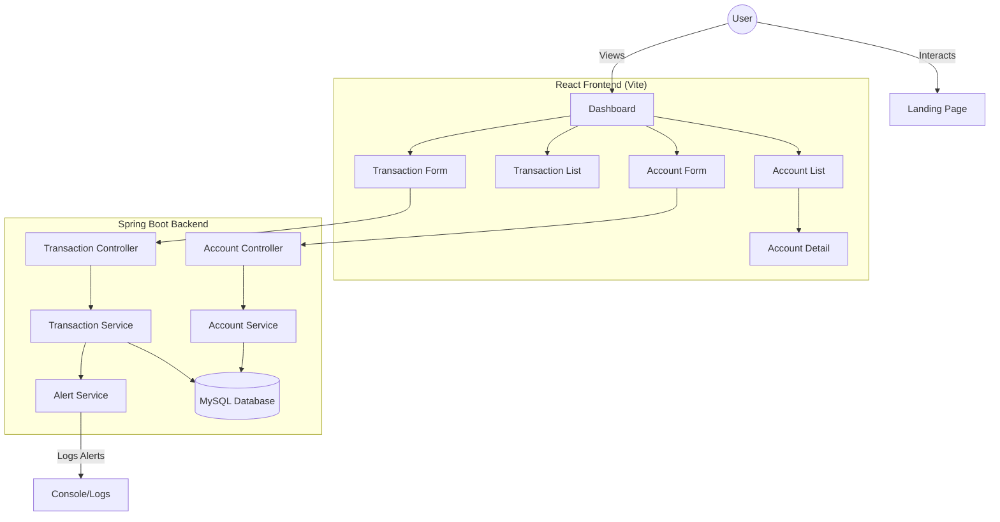

# VaultX Exchange 💳

VaultX Exchange is a modern, premium banking simulation platform designed for secure and efficient financial management. It features a robust Spring Boot backend and a dynamic React frontend with a high-end dark-themed aesthetic.

---

## 🌟 Features

### 🚀 Currently Implemented
- **Account Management**: Create and manage multiple accounts with automated account number generation.
- **Financial Operations**: Support for Deposits, Withdrawals, and Internal Transfers between accounts.
- **Dynamic Dashboard**: Real-time overview of total balances and recent activities.
- **Account Details**: In-depth view of individual account history and status.
- **Premium UI/UX**: Dark-mode interface with glassmorphism, smooth animations, and responsive layouts.
- **Transaction Alerts**: System-level monitoring for high-value transactions (logging).

### 🗺️ Future Roadmap (What needs to be added)
- **User Authentication**: Secure Login/Signup using JWT or OAuth2.
- **Email Notifications**: Integration with SMTP to send real-time transaction alerts to users' emails.
- **Analytics Dashboard**: Interactive charts and graphs for spending patterns and income analysis.
- **Profile Management**: User avatars, personal details update, and security settings.
- **Multi-currency Support**: Ability to hold and transfer funds in different global currencies.
- **Transaction Search & Filter**: Advanced lookup for historical transactions.

---

## 📊 System Architecture & Flow

The following flowchart illustrates the interaction between the user, the frontend components, and the backend services:



---

## 🏗️ Project Structure

### 💻 Frontend (React + Vite)
Located in `/frontend/src`:
- **`pages/`**: Main application views.
    - `LandingPage.jsx`: Premium landing experience with feature showcases.
    - `Dashboard.jsx`: Central hub for user accounts.
    - `AccountDetail.jsx`: Detailed history and management for a specific account.
- **`components/`**: Reusable UI elements.
    - `AccountForm.jsx`: Modal for account creation and editing.
    - `TransactionForm.jsx`: Unified logic for all financial transfers.
    - `Alert.jsx`: Global notification component for user feedback.
    - `AccountList.jsx` & `TransactionList.jsx`: Specialized data display components.
- **`services/`**: API integration layer for backend communication.

### ⚙️ Backend (Spring Boot)
Located in `/src/main/java/com/bank`:
- **`controller/`**: REST API endpoints mapping.
    - `AccountController.java`: Endpoints for account CRUD and lookup.
    - `TransactionController.java`: Endpoints for financial operations (Deposit/Transfer).
- **`service/`**: Core business logic.
    - `AccountService.java`: Logic for account lifecycle and balance management.
    - `TransactionService.java`: Atomic transaction processing logic.
    - `AlertService.java`: Monitoring logic for transaction thresholds.
- **`entity/` & `repository/`**: Persistence layer using JPA/Hibernate.
- **`dto/`**: Data Transfer Objects for clean API responses.

---

## 🛠️ Technology Stack

| Layer | Technologies |
| :--- | :--- |
| **Backend** | Spring Boot 3.2.x, Java 17, Spring Data JPA, MySQL |
| **Frontend** | React 18, Vite, React Router 6, Vanilla CSS (Glassmorphism) |
| **Icons** | Lucide React |
| **Security** | Jakarta Validation, Lombok (Planned: Spring Security + JWT) |

---

## 🚀 Installation & Setup

### 1. Backend Setup
1. Navigate to the root directory.
2. Configure your database in `.env` (copied from `.env.example`).
3. Run Maven:
   ```bash
   mvn clean install
   mvn spring-boot:run
   ```

### 2. Frontend Setup
1. Navigate to `/frontend`.
2. Install & Start:
   ```bash
   npm install
   npm run dev
   ```

---

## 🎨 Branding Note

**VaultX Exchange** styling:
- **Vault**: Navy Blue
- **X**: Red
- **Exchange**: Gray (Uppercase)

---
© 2026 VaultX Exchange. All rights reserved.
