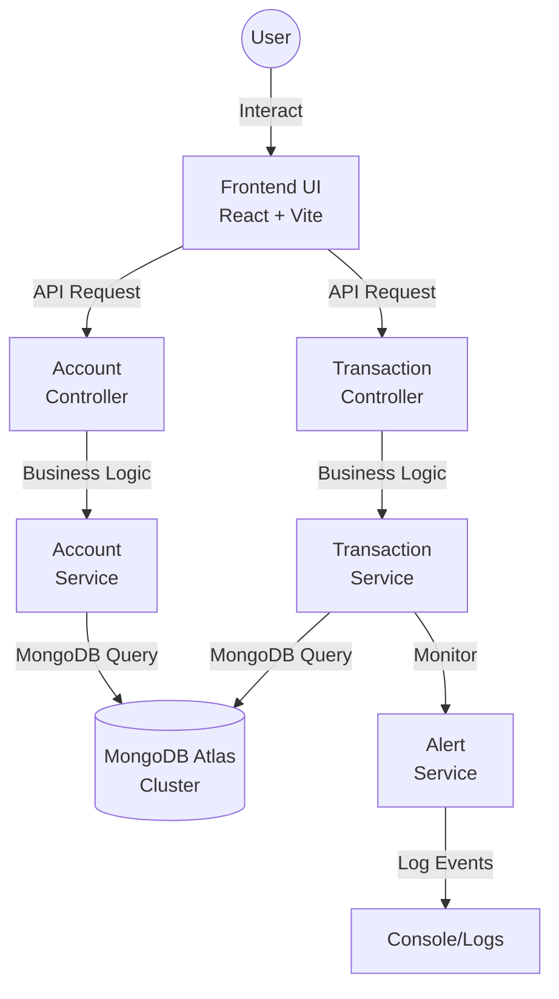

# VaultX Exchange

A modern, premium banking simulation platform designed for secure and efficient financial management. Built with a robust Spring Boot backend (deployed on Render) and a dynamic React frontend (deployed on Vercel) featuring a high-end dark-themed aesthetic with glassmorphism effects.

---

## Overview

VaultX Exchange is a full-stack financial management application that demonstrates professional banking operations including account management, fund transfers, and real-time transaction monitoring. The platform prioritizes user experience with an intuitive interface and responsive design, backed by a fast, cloud-native MongoDB Atlas database.

**Branding:**
- **Vault** - Navy Blue  
- **X** - Red  
- **Exchange** - Gray (Uppercase)

---

## Features

### Currently Implemented
- **AI Banking Assistant**: VaultX Chatbot with natural language processing for account creation, realtime balance checking, and financial transactions (Deposit, Withdraw, Transfer)
- **Secure Authentication**: KYC-compliant registration flow, user-defined passwords, and secure login utilizing BCrypt password hashing
- **Account Management**: Create and manage multiple accounts with automated 10-digit account number generation
- **Financial Operations**: Deposits, Withdrawals, and Internal Transfers between accounts with realtime UI synchronization
- **Dynamic Dashboard**: Real-time balance overview, recent activity tracking, and intelligent spending categorizations
- **Account Details View**: In-depth transaction history and account status
- **Premium UI/UX**: Professional cream & charcoal interface with glassmorphism effects, smooth animations, and responsive layouts
- **Cloud Database Integration**: Fully integrated with MongoDB Atlas for scalable document storage

### Planned Features
- **Email Notifications**: SMTP integration for real-time transaction alerts
- **Analytics Dashboard**: Interactive charts and spending pattern analysis
- **Profile Management**: User avatars, personal details, and security settings
- **Multi-currency Support**: Hold and transfer funds in multiple global currencies
- **Advanced Search & Filters**: Historical transaction lookup and filtering capabilities

---

## System Architecture

### Architecture Diagram
```text
┌─────────────────────────────────────────────────────────────────┐
│                          USER INTERFACE                          │
│                (React + Vite Frontend — Vercel)                  │
│  ┌────────────────────────────────────────────────────────────┐ │
│  │  Landing Page │ Dashboard │ Account Detail │ Forms         │ │
│  └────────────────────────────────────────────────────────────┘ │
└────────────────────────────┬────────────────────────────────────┘
                             │ HTTP/REST API
┌────────────────────────────▼────────────────────────────────────┐
│                    BACKEND SERVICES                              │
│         (Spring Boot 3.2.x on Java 17 — Render / Docker)         │
│  ┌────────────────────────────────────────────────────────────┐ │
│  │ Controllers │ Services │ Repositories │ Document Mapping   │ │
│  └────────────────────────────────────────────────────────────┘ │
└────────────────────────────┬────────────────────────────────────┘
                             │ Spring Data MongoDB
┌────────────────────────────▼────────────────────────────────────┐
│                     PERSISTENCE LAYER                            │
│                  MongoDB Atlas (Cloud Cluster)                   │
│  (Accounts, Transactions, User Data as BSON Documents)          │
└─────────────────────────────────────────────────────────────────┘
```

### Data Flow


```mermaid
graph TD
    User((User)) -->|Interact| UI[Frontend UI<br/>React + Vite]
    
    UI -->|API Request| AC[Account<br/>Controller]
    UI -->|API Request| TC[Transaction<br/>Controller]
    
    AC -->|Business Logic| AS[Account<br/>Service]
    TC -->|Business Logic| TS[Transaction<br/>Service]
    
    AS -->|MongoDB Query| DB[(MongoDB Atlas<br/>Cluster)]
    TS -->|MongoDB Query| DB
    
    TS -->|Monitor| ALS[Alert<br/>Service]
    ALS -->|Log Events| Console[Console/Logs]
```

---

## Project Structure

### Frontend Architecture (`/frontend`)

```text
frontend/
├── src/
│   ├── pages/               # Top-level route components (Dashboard, Landing, etc)
│   ├── components/          # Reusable UI elements (Modals, Forms, Lists)
│   ├── services/            # Axios API handlers for backend communication
│   ├── styles/              # Global CSS & Glassmorphism design tokens
│   └── App.jsx              # Main React Router configuration
├── vercel.json              # Vercel deployment rewrite rules for SPA routing
├── .env                     # Local frontend environment variables
└── .env.production          # Production frontend environment variables
```

### Backend Architecture (`/src/main/java/com/bank`)

```text
backend/
├── controller/
│   ├── AccountController.java    # Account CRUD REST endpoints
│   └── TransactionController.java # Financial operations REST endpoints
├── service/
│   ├── AccountService.java       # Account lifecycle & BCrypt logic
│   ├── TransactionService.java   # Financial business logic & balance calculation
│   └── AlertService.java         # Monitoring & alerting
├── entity/
│   ├── Account.java              # MongoDB @Document mapped entity
│   └── Transaction.java          # MongoDB @Document mapped entity
├── repository/
│   ├── AccountRepository.java    # MongoRepository data access
│   └── TransactionRepository.java # MongoRepository data access
├── dto/
│   ├── AccountDTO.java           # Data transfer objects for APIs
│   └── TransactionDTO.java
└── config/
    └── WebConfig.java            # Global CORS configuration
```

### Infrastructure Files
- `Dockerfile`: Multi-stage build for deploying the Java backend as a lightweight container.
- `render.yaml`: Infrastructure-as-code configuration for Render deployment.
- `pom.xml`: Maven dependency configuration including `spring-boot-starter-data-mongodb`.

---

## Technology Stack

| Layer | Technology | Version |
|-------|-----------|---------|
| **Backend Runtime** | Java | 17+ |
| **Backend Framework** | Spring Boot | 3.2.x |
| **ORM / ODM** | Spring Data MongoDB | Latest |
| **Database** | MongoDB Atlas | Cloud |
| **Frontend Framework** | React | 18+ |
| **Build Tool** | Vite | Latest |
| **Deployment** | Render (Backend), Vercel (Frontend) | - |
| **Containerization** | Docker | Latest |
| **Build** | Maven | 3.8+ |

---

## Getting Started

### Prerequisites
- **Java 17+** installed and configured
- **Node.js 16+** and npm 8+ installed
- **MongoDB Atlas** connection string
- **Maven 3.8+** for backend builds

### 1️⃣ Backend Setup

#### Step 1: Configure Environment Variables
```bash
# Clone or navigate to project root
cd vaultx-exchange

# Create .env file for local development
cat > .env << EOF
MONGODB_URI=mongodb+srv://<username>:<password>@<cluster>.mongodb.net/<database>?retryWrites=true&w=majority
PORT=8082
FRONTEND_URL=http://localhost:5173
EOF
```

#### Step 2: Install Dependencies & Run
```bash
# Install dependencies
mvn clean install

# Run Spring Boot application
mvn spring-boot:run

# Server will start on http://localhost:8082
```

### 2️⃣ Frontend Setup

#### Step 1: Install Dependencies
```bash
# Navigate to frontend directory
cd frontend

# Install npm packages
npm install
```

#### Step 2: Configure Environment
```bash
# Create .env file
cat > .env << EOF
VITE_API_URL=http://localhost:8082/api
EOF
```

#### Step 3: Start Development Server
```bash
# Start Vite dev server
npm run dev

# Application will be available at http://localhost:5173
```

---

## Deployment Guide

### Deploying Backend to Render
1. Ensure your code is pushed to GitHub.
2. In the Render Dashboard, create a new **Web Service** from your repository.
3. Render will automatically detect the `render.yaml` and `Dockerfile` in the root.
4. In Render's **Environment Variables** section, add your `MONGODB_URI`.
5. Deploy the application. Render will automatically expose the app via HTTPS.

### Deploying Frontend to Vercel
1. In the Vercel Dashboard, import your GitHub repository.
2. Set the Framework Preset to **Vite** and Root Directory to **`frontend`**.
3. In Vercel's **Environment Variables** section, set `VITE_API_URL` to your Render backend URL.
4. Click **Deploy**. Vercel will automatically use `vercel.json` to handle React Router navigation paths.

---

## API Endpoints

### Account Management

| Method | Endpoint | Purpose |
|--------|----------|---------|
| `GET`  | `/api/accounts` | List all accounts |
| `POST` | `/api/accounts` | Create new account |
| `GET`  | `/api/accounts/{id}` | Get account details |
| `PUT`  | `/api/accounts/{id}` | Update account |
| `DELETE` | `/api/accounts/{id}` | Delete account |
| `POST` | `/api/accounts/login` | Authenticate account login |

### Transaction Management

| Method | Endpoint | Purpose |
|--------|----------|---------|
| `POST` | `/api/transactions/deposit` | Deposit funds |
| `POST` | `/api/transactions/withdraw` | Withdraw funds |
| `POST` | `/api/transactions/transfer` | Transfer between accounts |
| `GET`  | `/api/transactions/history/{accNo}` | Get transaction history for an account |
| `GET`  | `/api/transactions` | Get system-wide transaction history |

---

## Security Considerations

### Current Implementation
- **BCrypt Password Hashing**: Passwords stored securely in MongoDB
- **CORS Configuration**: Restricts API calls to approved origins (`frontendUrl`)
- **JSON Input Validation**: Enforced via Spring REST parameters

### Planned Security Features
- JWT-based authentication
- Role-based access control (RBAC)
- API rate limiting
- Real-time Email notifications (SendGrid SMTP)

---

## Support & Contact

**Last Updated**: April 2026  
**Version**: 1.1.0-RC1 (MongoDB Edition)

---

## Learning Resources
This project demonstrates:
- Migrating from SQL to NoSQL Document Storage (MongoDB)
- Docker Containerization and Render Deployment
- SPAs Deployment on Vercel
- React Component Architecture
- Asynchronous API Promises
